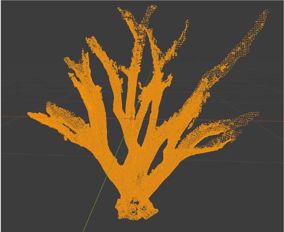
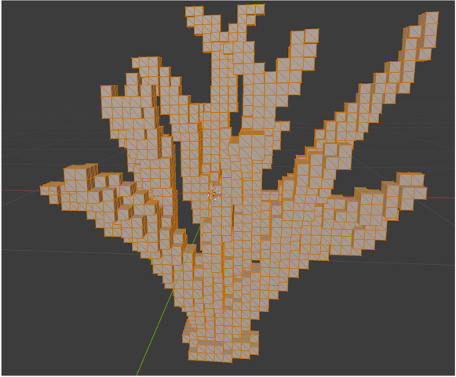

# whlib

##  简介

* whlib是一个基于Eigen编写的封装了点云和网格模型相关操作的C++库；
* 支持obj格式点云模型，网格模型，线框模型文件的读写。

## 目录结构

* whilb
  * bin:存放mac/win下的可执行文件
    * mac
    * win
  * deps:存放第三方依赖
    * boost
    * eigen
    * glm
  * include:whlib头文件
    * algorithm
    * basic
    * utils
  * makefile_temp:临时makefile文件夹
  * model:存放.obj模型文件
  * src:whlib 源代码存放文件
  * temp:临时文件存放
  * test:测试文件存放
  * README.md

## 编译成静态库

* mac环境下已经编译成静态库libwhlib.a，并存放在根目录下，如果需要重新编译，编译方法同win
* win下编译成静态库（需要修改makefile静态库后缀）

```shell
cd your_path_to_whlib
make clean //清理mac下生成的相关文件
make -j8 STATIC_LIB=TRUE //编译成静态库
```

## 包含所有头文件

主需要包含include目录下的whlib.h文件即可

```C++
#include <whlib.h>
```


## IO

### .obj点云IO

```C++
#include <whlib.h>
int main(){
  //读取点云
  wh::basic::PointCloud point_cloud;
  wh::utils::io::load_point_cloud_obj("model/BirdM2.obj", &point_cloud);
  //保存点云
  wh::utils::io::save_point_cloud_obj("model/BirdM3.obj", &point_cloud);
  return 0;
}

//运行程序
/**
Point Cloud size:11537
Load Point Cloud Successfully!
Save Point Cloud Successfully!
*/
```

### .obj多边形网格IO

```C++
#include <whlib.h>
int main(){
  //读入多边形网格
  wh::basic::PolygonMesh mesh;
  wh::utils::io::load_polygon_mesh_obj("model/BirdM2_vox_0.02_2.obj", &mesh);
  //存放多边形网格
  wh::utils::io::save_polygon_mesh_obj("model/BirdM2_vox_0.02_3.obj", &mesh);
  return 0;
}

//运行程序
/**
verticesAmount:45552
facesAmount:68328
UVAmount:0
normalsAmount:0
Load Polygon Mesh Successfully!
verticesAmount:45552
facesAmount:68328
Save Polygon Mesh Successfully!
*/
```

### .obj骨架线IO

```C++
#include <whlib.h>
int main(){
  //读取骨架线
  wh::basic::Skeleton skel;
  wh::utils::io::load_skeleton_obj("model/tree4_84336_nor_bb_wf_vox_0.05.obj", &skel);
  // //存放骨架
  wh::utils::io::save_skeleton_obj("model/tree4_84336_nor_bb_wf_vox_0.05.obj", &skel);
  return 0;
}

//运行程序
/**
pointsAmount:26392
edgesAmount:39588
# whlib cube wireframes obj file
# Tue Feb 23 21:00:29 2021
o 05
Load Skeleton Successfully!
Save Skeleton Successfully!
*/
```

## 点云常用操作

### 获取点云bounding_box，归一化

```C++
//读取点云
wh::basic::PointCloud point_cloud;
wh::utils::io::load_point_cloud_obj("model/BirdM2.obj", &point_cloud);

//获取点云bounding_box，返回一个Cube
wh::basic::Cube bounding_box = point_cloud.get_bounding_box();
//点云归一化，返回归一化后的bounding_box
wh::basic::Cube nor_point_cloud_bounding_box = point_cloud.get_normalized_point_cloud();
//保存bounding_box
wh::utils::io::save_cube_wireframe_obj("model/bounding_box.obj", &bounding_box);
wh::utils::io::save_cube_wireframe_obj("model/nor_point_cloud_bounding_box.obj", &nor_point_cloud_bounding_box);
//保存点云
wh::utils::io::save_point_cloud_obj("model/BirdM3.obj", &point_cloud);
```

### 获取点云的体素网格模型并保存

```C++
//读取点云
wh::basic::PointCloud point_cloud;
wh::utils::io::load_point_cloud_obj("model/BirdM2.obj", &point_cloud);

//获取点云bounding_box，返回一个Cube
wh::basic::Cube bounding_box = point_cloud.get_bounding_box();
//点云归一化，返回归一化后的bounding_box
wh::basic::Cube nor_point_cloud_bounding_box = point_cloud.get_normalized_point_cloud();
//保存bounding_box
wh::utils::io::save_cube_wireframe_obj("model/bounding_box.obj", &bounding_box);
wh::utils::io::save_cube_wireframe_obj("model/nor_point_cloud_bounding_box.obj", &nor_point_cloud_bounding_box);
//保存点云
wh::utils::io::save_point_cloud_obj("model/BirdM3.obj", &point_cloud);

//获取点云的体素网格模型并保存
float leaf_size = 0.02;//体素的大小
//获取体素对应的Cube
std::set<wh::basic::Cube> point_cloud_voxel = point_cloud.voxelization(nor_point_cloud_bounding_box, leaf_size);
//将体素保存为线框
wh::utils::io::save_cube_wireframes_obj("model/point_cloud_voxel.obj", point_cloud_voxel);
//将体素保存为mesh
wh::utils::io::save_tri_cube_meshes_obj("model/point_cloud_voxel.obj", point_cloud_voxel);
```

原始点云



体素化后的mesh:



## 其他

* 命名规则

  * 所有类使用大驼峰命名法，例如PointCloud；

  * 所有文件（包括头文件）命名使用下划线命名法，例如point_cloud（除某种算法的缩写使用大写，例如LOP）；

  * 所有成员变量（包括成员方法使用）命名使用下划线命名法，例如create_unordered_edges();

    

